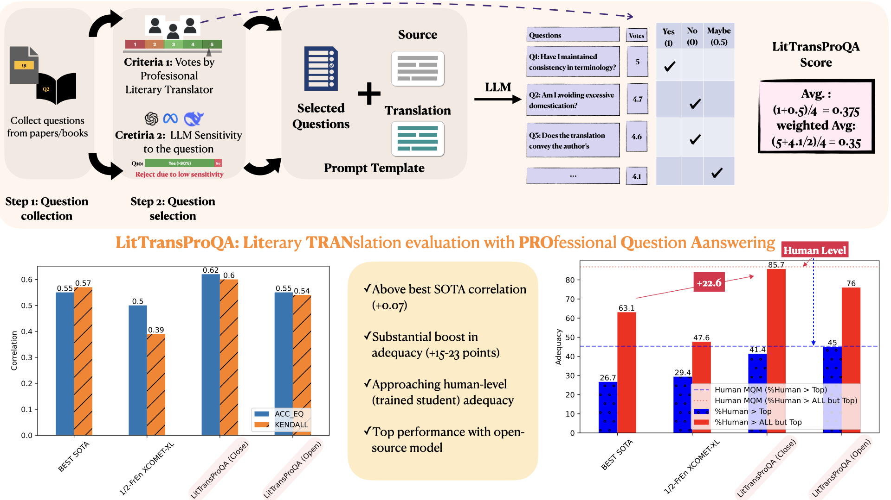

# TransProQA

TransProQA is an LLM-based QA metric for literary translation evaluation. 

## News:
 - 08.05.2025: Preliminary release of code and dataset (copyright-free).

## Project Structure

```
TransProQA/
├── datasets/                    # Dataset directory
│   ├── finetuning_dataset/     # Datasets for model fine-tuning
│   └── evaluation_set/         # Datasets for evaluation
├── finetuneing_method/         # Fine-tuning related code
│   ├── configs/               # Configuration files
│   ├── xcomet_regression.py   # Regression task
│   ├── xcomet_inference.py    # Inference implementation
│   └── xcomet_ranking.py      # Ranking task
├── prompting_method/          # Prompt-based approaches
│   ├── template/             # Prompt templates
│   ├── QA_translators/       # translator votes
│   ├── prompt_openrouter.py  # API integration
│   ├── run_all_models.py     # Model execution script
│   └── build_dataset.py      # Prompt preparation
└── SOTA_metric/              # State-of-the-art metrics
    └── m_prometheous.py      # Prometheus metric implementation
```

## Features

- **Multiple Assessment Methods**:
  - Fine-tuning based approaches using XCOMET
  - Prompt-based TransProQA: question-answering based translation evaluation
  - Other SOTA metrics

## Getting Started

### TranProQA Overview


### Prerequisites

- Python 3.8+
- Required packages (to be added to requirements.txt)

### Usage
```bash
To be updated
```

## License

This project is licensed under the MIT License - see the LICENSE file for details.

## Citation

If you use this code in your research, please cite:

```bibtex
To be updated
```
